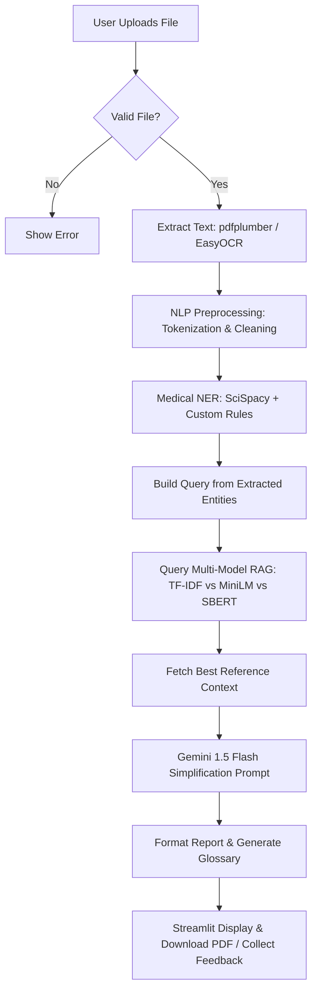

# 🏥 Medical Report Simplifier — Project Presentation Guide

This guide breaks down the project into clear, simple, and structured sections to help you explain it confidently to your teacher.

---

## 🌟 1. Project Overview (The "Elevator Pitch")
Medical reports (like blood tests, MRI scans, or lipid panels) are written in complex medical jargon that is hard for average patients to understand. 

Our project, the **Medical Report Simplifier**, is an AI-powered system that:
1. **Accepts** medical reports in multiple formats (PDFs, images of reports, or raw text).
2. **Extracts** text using smart fallback mechanisms (digital text extraction or OCR for scanned images).
3. **Identifies** key medical terms (diseases, tests, medications, values) using specialized biomedical NLP.
4. **Retrieves** trusted medical context from a curated local knowledge base using a **Multi-Model RAG (Retrieval-Augmented Generation)** framework.
5. **Simplifies** the report into an 8th-grade reading level using **Google Gemini 1.5 Flash**, inserting helpful explanations and generating a downloadable PDF report.

---

## 🛠️ 2. Key Technologies (The Tech Stack)
* **Programming Language**: Python (3.10/3.11)
* **User Interface**: Streamlit (for building interactive web dashboards quickly)
* **Text Extraction**: `pdfplumber` (digital PDFs), `EasyOCR` (scanned images/PDFs), and `Pillow` (image preprocessing)
* **Natural Language Processing (NLP)**:
  * `spaCy` & `NLTK` (basic text prep and sentence tokenization)
  * `SciSpacy` (specifically the `en_ner_bc5cdr_md` model, developed by Allen Institute for AI for medical named entity recognition)
* **Vector Database & Similarity Search**:
  * `scikit-learn` (TF-IDF vectorization)
  * `sentence-transformers` (`all-MiniLM-L6-v2` & `all-mpnet-base-v2` / SBERT)
  * `FAISS` (Facebook AI Similarity Search - for high-performance dense vector search)
* **Large Language Model (LLM)**: Google Gemini API (`gemini-1.5-flash`)
* **Output Generation**: `fpdf2` (to dynamically compile results into a clean, downloadable PDF)

---

## 📐 3. The 12-Step Processing Pipeline (How it works under the hood)



### Step 1: Input Validation
* **File**: [input_handler.py](file:///c:/Users/Admin/Desktop/My%20stuff/Christ/3rd%20Sem/NLP/MedicalReportSimplifier/modules/input_handler.py)
* **What it does**: Checks if the file is an allowed type (PDF, PNG, JPG, JPEG, TXT), ensures it is under 10MB, and makes sure it has fewer than 50 pages. This prevents system crashes from massive files.

### Step 2: Hybrid Text Extraction
* **File**: [text_extractor.py](file:///c:/Users/Admin/Desktop/My%20stuff/Christ/3rd%20Sem/NLP/MedicalReportSimplifier/modules/text_extractor.py)
* **What it does**: If the user uploads a digital PDF, we extract text using `pdfplumber`. If the PDF is scanned (contains no digital text) or is an image (JPEG/PNG), the pipeline automatically triggers **EasyOCR** to read the characters from the image.

### Step 3: NLP Preprocessing
* **File**: [text_preprocessor.py](file:///c:/Users/Admin/Desktop/My%20stuff/Christ/3rd%20Sem/NLP/MedicalReportSimplifier/modules/text_preprocessor.py)
* **What it does**: Cleans up whitespace, tokenizes sentences, and gets a normalized version of the text ready for medical search queries.

### Step 4: Medical Named Entity Recognition (NER)
* **File**: [info_extractor.py](file:///c:/Users/Admin/Desktop/My%20stuff/Christ/3rd%20Sem/NLP/MedicalReportSimplifier/modules/info_extractor.py)
* **What it does**: This is where standard NLP is applied. 
  * We use **SciSpacy** (a model trained specifically on biomedical articles) to locate terms belonging to **Diseases/Chemicals/Drugs**.
  * We combine this with **Regex rules** to find medical measurements (e.g., `120/80 mmHg`, `5.2 mmol/L`) and lab test names (e.g., `Hemoglobin`, `TSH`).

### Step 5: Document Indexing (Preprocessing for RAG)
* **File**: [document_indexer.py](file:///c:/Users/Admin/Desktop/My%20stuff/Christ/3rd%20Sem/NLP/MedicalReportSimplifier/modules/document_indexer.py)
* **What it does**: Before searching, we split our medical reference documents into small chunks (~512 characters). We then represent these chunks mathematically in three different vector spaces (TF-IDF, MiniLM, and SBERT) and save the FAISS indices.

### Step 6: Multi-Model RAG Search (The Heart of the Project)
* **File**: [retrieval_engine.py](file:///c:/Users/Admin/Desktop/My%20stuff/Christ/3rd%20Sem/NLP/MedicalReportSimplifier/modules/retrieval_engine.py)
* **What it does**: We take the extracted medical terms from Step 4 and search our local reference library using three different retrieval models side-by-side:
  1. **TF-IDF (Term Frequency-Inverse Document Frequency)**: A traditional keyword matching algorithm (baseline).
  2. **MiniLM (Dense Vector Embeddings + FAISS)**: A lightweight semantic search model that looks for meaning rather than exact words.
  3. **SBERT (Sentence-BERT + FAISS)**: A deeper, highly accurate sentence transformer (`all-mpnet-base-v2`) for robust semantic search.

### Step 7: Retrieval Evaluation
* **File**: [evaluation.py](file:///c:/Users/Admin/Desktop/My%20stuff/Christ/3rd%20Sem/NLP/MedicalReportSimplifier/modules/evaluation.py)
* **What it does**: Measures the performance of the three models side-by-side on:
  * **Search Latency (ms)**: How fast the search returned results.
  * **Similarity Score**: How closely matched the document chunk is to the query terms.
  This allows researchers/teachers to see the trade-off between speed (TF-IDF/MiniLM) and depth (SBERT).

### Step 8: Context Selection & Clean-Up
* **File**: [retrieval_engine.py](file:///c:/Users/Admin/Desktop/My%20stuff/Christ/3rd%20Sem/NLP/MedicalReportSimplifier/modules/retrieval_engine.py#L166-L197)
* **What it does**: Merges the top-matching reference texts from the preferred search model (usually SBERT) into a reference context package.

### Step 9: LLM Simplification Engine
* **File**: [simplification_engine.py](file:///c:/Users/Admin/Desktop/My%20stuff/Christ/3rd%20Sem/NLP/MedicalReportSimplifier/modules/simplification_engine.py)
* **What it does**: Sends a request to **Google Gemini 1.5 Flash** with:
  * The original medical report.
  * The retrieved medical guidelines (RAG context) to ensure accuracy.
  * The list of extracted terms.
  * A system prompt instructing the model to translate this into an 8th-grade level, add explanations, and format it clearly.

### Step 10: Formatting & PDF Export
* **Files**: [output_generator.py](file:///c:/Users/Admin/Desktop/My%20stuff/Christ/3rd%20Sem/NLP/MedicalReportSimplifier/modules/output_generator.py) & [output_delivery.py](file:///c:/Users/Admin/Desktop/My%20stuff/Christ/3rd%20Sem/NLP/MedicalReportSimplifier/modules/output_delivery.py)
* **What it does**: Formats the explanation markdown, creates a custom visual glossary at the bottom of the page, and compiles it into a downloadable PDF format.

### Step 11: Feedback Loop
* **File**: [feedback.py](file:///c:/Users/Admin/Desktop/My%20stuff/Christ/3rd%20Sem/NLP/MedicalReportSimplifier/modules/feedback.py)
* **What it does**: Allows the patient or a doctor to rate the summary (1–5 stars) and write comments, saving it locally. This feedback is compiled into global stats shown in the web interface.

---

## 📈 4. RAG Explained Simply (Retrieval-Augmented Generation)
Your teacher will definitely ask: **"Why do we need RAG? Why not just send the medical report to Gemini directly?"**

**Your Answer:**
> "If we send a report directly to a general AI model (LLM), it might make mistakes or hallucinate (make up facts). Under-the-hood medical values vary (e.g., standard lipid thresholds, kidney filtration rates). By using **RAG**, we search a trusted, local library of medical textbooks/guidelines, find the exact match for the patient's test, and feed that text to Gemini as a 'fact sheet.' Gemini is only allowed to translate based on the facts we retrieved. This makes the output extremely accurate, safe, and custom-tailored to the lab's rules."

---

## 💻 5. Running the Project Demo
If you need to show a live demo:
1. Open terminal in the directory.
2. Run:
   ```bash
   streamlit run app.py
   ```
3. Show the tabs in the browser:
   * **📄 Simplified Report**: Shows the plain-language summary and the **Download PDF** button.
   * **🔍 Medical NER Explorer**: Shows exactly what medical words the model extracted.
   * **📊 RAG Model Comparison**: Displays charts comparing TF-IDF, MiniLM, and SBERT search times and scores.
   * **📈 System Feedback**: Lets you submit rating scores and shows average performance metrics.
